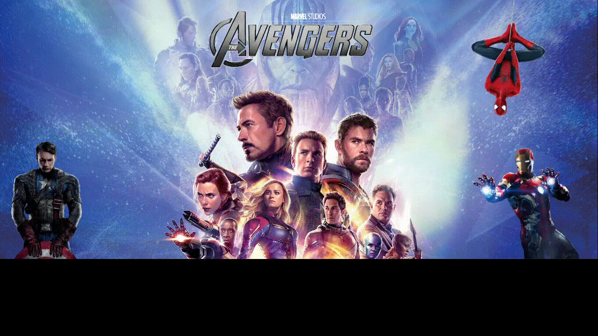

<H1>Desafio em grupo para praticar animações CSS, e FLEXBOX</H1>

O desafio é criar uma página de lançamento de um filme qualquer, e em grupo animar e posicionar os elementos na página, a atividade é livre.

Clique para ver o projeto em execução
https://leokrindges.github.io/pagina_de_um_filme_animada/

<picture>
 <source media="(prefers-color-scheme: dark)" srcset="./assets/2024-01-15-23-22-51.gif">
 <source media="(prefers-color-scheme: light)" srcset="./assets/2024-01-15-23-22-51.gif">
 
</picture>
